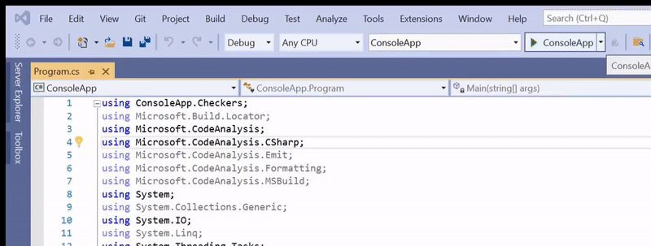

# CSharp AST Fix

Zadatak koji je rešavan u okviru ovog projekta je analiza koda u jeziku *C#*, detektovanje i popravka neispravnih ili nedovoljno dobrih sintaksnih konstrukata. Aplikacija vrši zamenu nepoželjnih konstrukata onima koji su poželjniji, tako da funkcionalnost koda ostane nepromenjena.

-------------------------------------

## (1) Prevođenje i pokretanje projekta (neophodne biblioteke, alati i zavisnosti)

Aplikacija je rađena u programskom jeziku *C#* uz korišćenje *Roslyn* *API*ja, u *Visual Studio* okruženju, na *Linux* (*Ubuntu*) operativnom sistemu. Za pokretanje aplikacije potrebno je instalirati *Visual Studio* okruženje. Projekat je moguće uvesti u *Visual Studio* okruženje i pokrenuti aplikaciju pritiskom na tastere *Ctrl+F5*.

-------------------------------------

## (2) Primeri upotrebe (upotreba izvršne verzije)

Nakon pokretanja aplikacije otvara se konzola, gde treba uneti:

- putanju do *.cs* fajla koji treba transformisati

- putanju do izlaznog *.cs* fajla u kome će transformisani kod biti upisan

- argument komandne linije, tj. opciju željene transformacije (-forToWhile, -varToType, -switchToIf ili -removeEmpty)

Opcije i opisi transformacija dati su u narednoj tabeli:

| Opcija | Transformacija |
| ------------- | ------------- |
| -forToWhile | zamena *for* petlje *while* petljom |
| -varToType | zamena ključne reči *var* eksplicitnim tipom |
| -switchToIf | zamena naredbe *switch* naredbom *if-else* |
| -removeEmpty | izbacivanje praznih naredbi |



-------------------------------------

## (3) Ulazni primeri koji se mogu koristiti za upotrebu i testiranje programa

Test primeri se nalaze u direktorijumu *ConsoleApp*, odnosno na putanji *2020_02_CSharp_AST_Fix\ConsoleApp*. U nastavku je dat prikaz jednog od test primera.

```csharp
using System;
using System.Collections.Generic;
using System.Text;

namespace ConsoleApp
{
    class test
    {
        public void Test()
        {
            int Limit(int max, int[] array)
            {
                return Math.Min(max, array.Length);
            }
            
            int[] values = { 10, 20, 30, 40 };
            var x = 3;
            var y = 11.0;

            //
            var z = x > y ? x - y : y - x;
            Console.WriteLine(z);
            //

            for (int i = 0; i < Limit(2, values); i++)
            {
                for (int j = 0; j < Limit(10, values); j++)
                {
                    Console.WriteLine("LIMIT 10: " + values[j]);
                    for (int k = 0; k < Limit(10, values); k++)
                    {
                        Console.WriteLine("LIMIT 10: " + values[k]);
                    }
                }
                Console.WriteLine("LIMIT 2: " + values[i]);
            }
            
            var s = "1234";
            for (int i = 0; i < Limit(10, values); i++)
            {
                Console.WriteLine("LIMIT 10: " + values[i]);
            }
        }
    }
}
```

# Članovi tima

Dotlić Aleksandra 1077/2020

Đaković Branko 1083/2019

Pejkić Jovana 1089/2020

Petrović Ana 1073/2020

